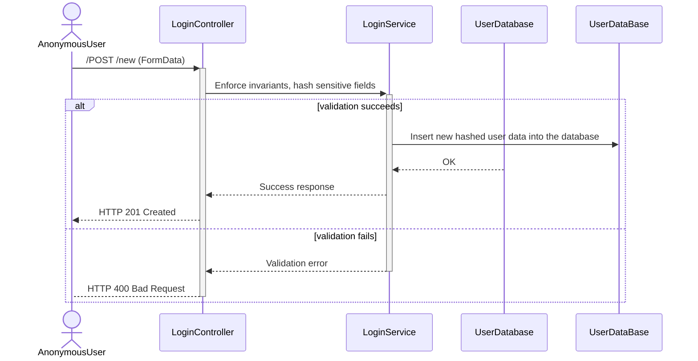

# Bloggo
Minimum Viable Product

---

Mål:
1. Oversikt over blogger og forfattere.
2. En forfatter skal kunne opprette flere innlegg.
3. Innlegg skal kunne drøftes før publisering.
4. En forfatter skal kunne sammarbeide med andre forfattere.
5. Det skal kunne datostemple innleggets opprettelse og endringer.
6. Det skal kunne "tracke" anntall visninger til spesifikke innlegg.
7. Data skal lagres i SQLite, med abstraksjoner og relasjoner.
8. Det skal være en front-end, brukergrensesnittet skal være forskjellig
   basert på om brukeren aktivt arbeider på ett spesifikt innlegg, eller 
   om de er en leser av ett innlegg.

## Krav for datahåndtering
1. Sensitive og priviligert informasjon må kunne kommuniseres kryptert, 
   dette gjelder spesielt for innlogging fra httpForms. Innloggingsprosessen 
   skal returnere en token, for å opprette og vedlikeholde innloggingsøkten.
    - Brukere skal kunne opprette nye sidebrukere fra brukernavn og passord.
    - Passord skal ikke lagres i plaintext, og skal ikke eksistere i
      minnet lengre enn nødvendig.
        - Eventuelle valg av backend språk kan bety at minnet må manuelt
          forsøpples, f.eks. pga. forsinket GC reclaimation.
    - Utenom forfattere av innlegg, skal brukernavn anonymiseres.
2. Det skal være en oversikt over innlegg.
    - Tittell på innlegg.
    - Forfattere.
    - Opprettelses dato.
    - Sist endret dato.
    - Anntall visninger.
3. Det skal være en oversikt over forfattere og deres relasjoner til innlegg.
    - Eier av innlegg.
    - Involvering i innlegg (med-forfatterskap).
4. Brukere skal kunne utføre CRUD operasjoner.
    - En registrert bruker skal kunne opprette ett innlegg. 
        - CREATE
    - En bruker skal kunne lese innlegg.
        - READ
    - En eier av ett innlegg skal kunne legge til og fjerne medforfatter(e). 
        - UPDATE
    - En forfatter eller medforfatter skal kunne endre innhold i innlegg.
        - UPDATE
    - En eier av ett innlegg skal kunne slette innlegget.
        - DELETE
        - En sletting vil sette innlegget i en kø som utfører destruering ved
          senere tid. Dette tillater at en angrer seg og kan gjennopprette innlegget.
    
## Utførelse av krav
Valg av backend-språk avgjøres ved senere dato. Designpattern er fastsatt, 
MVC (Model, View, Controller). SQLite databasen anvendes som "source of truth" for dataen. 
Frontend utformes i HTML, CSS, og Javascript.

### Backend
- Det skal lages modeller for data
    1. Brukere.
    2. Innlegg.
    3. EierRelasjoner.
    4. ForfatterRelasjoner.
    5. BrukerDTO.
    6. InnleggDTO.
- DTO (Data Transfer Objects) anvendes som en abstraksjon over data i databasen 
  og for å holde "business logic" separat fra objekter som anvendes av API-en.
- Controllers er ansvarlig for å hente ut og mate inn data. 
  Det skal være både en bruker controller og en innlegg controller.
- Frontend skal serveres fra statiske filer.
    - Default route og fallback route.
- Det skal også være en separat route til en login side, også fra statisk fil.

### Frontend
- HTML, CSS, og Javascript anvendes for å generere brukergrensesnittet.
- View genereres fra data i databasen.
    - Data motatt fra backend skal modelleres, og views basers på disse.
    - Det skal ikke antas en spesifikk eksistens, resultater skal bli `.map()`-et
      over, og `Object.keys` skal anvendes fremfor indexering.
- Det skal være en frontpage / hero page.
    - 

## Sekvensdiagrammer

1. Default route til API, /GET

2. Sekvens for eksisterende login token. Skjer ved første tilkobling til nettsiden.

3. Sekvens for login hvor token ikke eksisterer.

4. Sekvens for å lage en ny bruker.

5. Sekvens for å hente innleggdata til hovedsiden når en bruker entrer DefaultRoute.

6. Sekvens for å lage ett nytt innlegg

7. Sekvens for å redigere ett innlegg.

8. Sekvens for å slette ett innlegg.

## Entitetsrelasjonsdiagram

Det skal også lages relasjonstabeller som holder oversikt over hvilken bruker
som har en relasjon til hvilken blogpost.
  - User 1..n UserOwnerRelation 1..1 BlogPost
  - User 1..n UserAuthorRelation n..m BlogPost